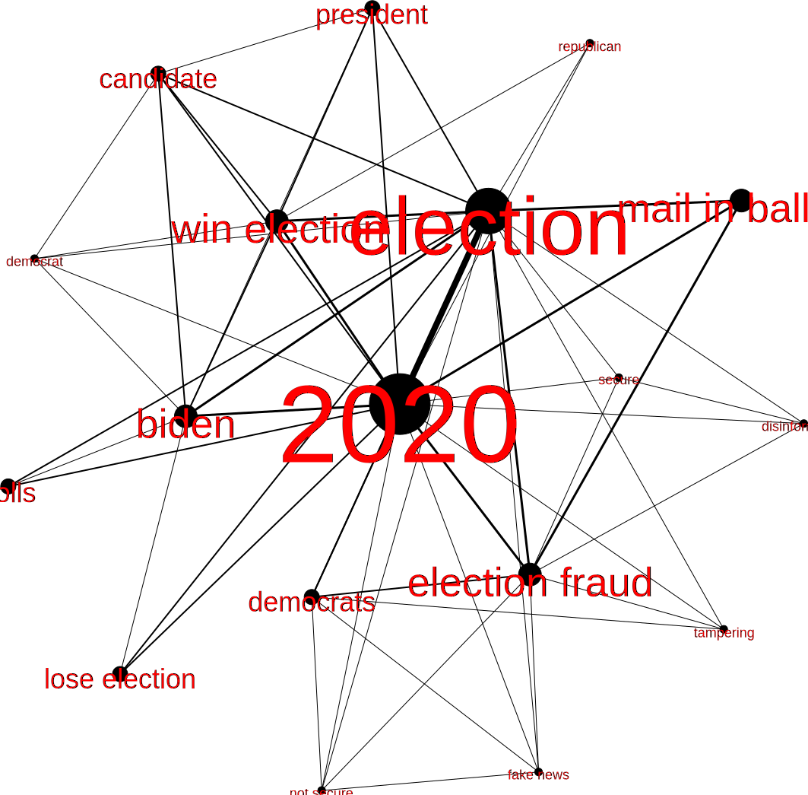

# Project Proposal for Student Development Grant
### Political Discourse on Youtube Surrounding the Trump Presidency

### Contents

1. [Intro](#intro)
2. [Methods](#methods)
3. [Timeline](#timeline)
4. [Importance](#importance)
5. [Mockup](#mockup)
6. [Budget](#budget)

### Intro 

&nbsp;&nbsp;&nbsp;&nbsp;The four years of the Trump Presidency has bourn witness to a number of historical events, such as the ongoing COVID-19 epidemic and the China-U.S Trade War. With the increasing degree of political polarization in the U.S during the Trump Presidency we are increasingly subject to situations where the public perceives and acts upon different and sometimes contradictory truths regarding these events. Such is the case with the ongoing epidemic and the divergent attitudes segments of the U.S population have adopted regarding preventative measures, which some scholars have argued is the case behind the U.S’s disastrous response measures. At the same time, the rise of Social Media in recent years has meant that these events, or more precisely the public perception of these events, has been meticulously recorded and this offers historians the opportunity to examine and analyze how the public, or different segments of the public, interpret and react to events occurring in their day. 

&nbsp;&nbsp;&nbsp;&nbsp;Youtube, the video sharing service, has emerged as one of the largest of the Social Media platforms with statistics showing that over 73% of adults in the U.S frequent the site[^Pew] and over a quarter of American obatin their news from YouTube[^Stocking]. Unlike service such as Twitter, Facebook, and TikTok, user content on Youtube is often long-form which allows individual creators to convey more organized thoughts and arguments. Like other Social Media services Youtube also includes a content tagging system which we can use to determine the characteristics of a specific video. This means Youtube is an excellent source of data regarding what events segments of the public are discussing and their perception of those events.

&nbsp;&nbsp;&nbsp;&nbsp;Since tags are set by the user and one method by which videos are found and recommended to viewers, we expect that creators interested in sharing their views regarding the Trump Presidency will include not only the event in their ‘tags’ but also words that suggest their perception or stance regarding the events discussed. We will visualize the data we collect using a digital network visualization tool and through the analysis of the results identify the events and issues discussed in regards to Trump’s presidency, how different segments of the public perceived these events and issues, and how different events and issues were interconnected in different discourses. Visualizations will be created for different time intervals (week, month, year) within the four years, each interval will contain videos uploaded during that period of time. These will be strung together in the form of a video or presentation in order to demonstrate how all the factors we examine shift over the period of Trump’s presidency as new events occur and issues are brought up. The final product will be showcased on a website where users will be able to toggle between differnt time intervals and pause the presentation to examine each vizualization in detail.

### Methods 

&nbsp;&nbsp;&nbsp;&nbsp;In order to collect tag data from all videos in the YouTube database regarding issues surrounding President Trump we will be using <a href="https://www.tubekit.org/index.php">TubeKit</a>, a web crawling tool designed for YouTube. Using TubeKit we can specify several attributes, in this case all videos with a tag associated to Trump made between 2016 and 2020, and the program will look through the Youtube database and collect all videos which meet our requirement. TubeKit will then allow us to extract video data, including video tags, from the videos in our set. The extracted information will be stored in a SQL database which can be hosted from our local computer. The SQL database can be imported into an Excel spreadsheet. 

&nbsp;&nbsp;&nbsp;&nbsp;Specifying a set of ‘Trump’ tags in our search parameter is the first issue we will encounter. While finding variations of ‘Trump’ and ‘DonaldTrump’ tags is possible if tedious, the issue arises when we consider that while YouTube is an American platform, the nature of the US and the internet means that a significant amount of YouTube content is not in English, not all English content is made in America, much of the content viewed in America was not made in America, and finally there is a large amount of non-English content made and viewed in America. Due to this combination of circumstance our analysis will be more vigorous if we include all content regardless of language. However, this is not feasible because we have neither the time nor the resources to consult an translator on every language videos on YouTube might be made in. The solution is then to take a middle ground and perhaps include only the five or ten most spoken languages in America. This will hopefully allow us to capture the majority of discourse surround Trump, while at the same time presenting a feasible number of tags to work through.

&nbsp;&nbsp;&nbsp;&nbsp;Our next step is to sort through the information and tally both the number of times each tag occurs, and the number of times each tag occurs alongside every other tag in the set we’ve collected, with the exception the Trump associated tags which will occur in every video. Since the information we will obtain will be in the form of a spreadsheet we can use the Apache POI Java API <a href="https://www.javatpoint.com/how-to-read-excel-file-in-java">Apache POI Java API</a> to construct a simple program that will iterate through the spreadsheet and tally the occurrences of each tag and the occurrences of each two tag combination. This program will write into two spreadsheets, the first will contain each tag that occurs the number of times it occurs. The second sheet will contain all the two tag combinations that occur and the number of times the combination occurs. The first sheet will be our node sheet and the second our edges sheet for our network visualization.

&nbsp;&nbsp;&nbsp;&nbsp;Before we visualize our data we will need to manually look through our node sheet and assign each node a specific category it falls under. For example, a ‘coronavirus’, ‘wuhan,’ or ‘covid’ tag would fall under a COVID-19 category. This category value will allow us to organize the visualization such that similar category tags are grouped together in our network and colorized. This presents the second issue in our methodology. The data we’ve gathered in and of itself has no inherent meaning; however, by assigning categories to tags, especially those tags which name individuals or organizations, we are undertaking a process of classification and thus attaching meaning to our data. How we sort the data by category will influence how our visualization will appear, and thus we need to be cautious in several areas. First for some tags, such as political individuals, we will need to conduct some research into how best to categorize these tags and which category to place each into. Secondly, since we will be translating non-English tags, we need to ensure that our translator provide us with sufficient context such that meaning lost in translation is minimized.

&nbsp;&nbsp;&nbsp;&nbsp;After this is complete we will use the software <a href="https://gephi.org/">Gephi</a>[^Bastian] to create a network visualization based upon our two spreadsheets. Gephi includes a variety of features that allow us to manipulate line weight, node sizes, and node distribution based on integer values given in our spreadsheets. Gephi will then allow us to export our network visualization as an SVG file which we can then add to a website to display the visualization and provide our analysis of the results. For our final product we expect to create network visualizations not only for the full 4 year period, but also for one year, one month, and one week intervals. This will allow us to examine how public discourse shifts over time as new events occur. The SVGs in each interval (week, month, year) will be presented to the user in the form of a slideshow which we can implement using JavaScript and event timers. The user will be able to switch between different intervals or pause the progression of the slides using button features on the website.

### Timeline 

&nbsp;&nbsp;&nbsp;&nbsp;Once we’ve received approval for our proposal we can begin work as early as Februrary of 2021, by which time we expect President Trump to have officially handed over power to President Biden. The first month of our work will involving updating all the members of our small team (potentially 2-3 members) on the specifics of this project and all the digital tools we will need to be familiar with. In parallel to this we will run TubeKit and crawl through the Youtube database, we expect the process of searching the database and collecting the attributes of all appropriate videos to take up to a month depending on our internet connection.

&nbsp;&nbsp;&nbsp;&nbsp;By month two we will have organized our team and completed our collection of data. We expect our simple program that tallys tags to take no more than a few days to complete. Running our data through the program will take at most a couple of days, giving ample room for errors in our coding which might require bug fixing. The tag data which we retrieve from our program will then be analyzed and categorized by our team. As discussed above this step will likely take the longest as we expect to find potentially tens of thousands of different tags. Some of these will be easy to categorize such as “COVID” or “Coronavirus,” others, which reference some event, individual, or organization, might be more difficult due to the reasons we’ve discussed in our methods. Additionally our team will need to frequently convene to ensure that our categorization is consistent. For these reason we expect this process to run up until month five or month six. 

&nbsp;&nbsp;&nbsp;&nbsp;An additional hurdle to the process of categorization is the existence of non-english tags, as discussed in our intro and methods. For this reason we will need to contract translators in the appropriate languages to translate tags in languages not spoken by members of our team. This will occur alongside our categorization; however, we expect this to take a significant share of our funding as translators will also need to provide us with additional context to ensure meaning lost in translation is minimized.

&nbsp;&nbsp;&nbsp;&nbsp;After categorizing our tags we run our data through Graphi, this step will take no more than a day or two. The product of this should be our four-year visualization. Next we update our tallying program to automatically assign categorizations to tags and then run our original data by the time interval of the upload date through our program and then Graphi to obtain time interval visualizations. This step will take no more than a week. The remainder of the month will be spent designing our website and incorporating our series of visualizations into the layout. A suitable host for our website that falls within our budget will also need to be found. This leaves us with five or six months left to conduct our analysis of the data we have visualized and commit our analysis to writing. Which is ample time and gives us breathing room in case some steps, such as the categorization of tags, take longer than anticipated.

<iframe width="100%" height="400" src="https://time.graphics/embed?v=1&id=451680" frameborder="0" allowfullscreen></iframe>

<a  style="font-size: 12px; text-decoration: none;" title="Gantt chart template" href="https://time.graphics">Proposal Timeline</a>

### Importance 

&nbsp;&nbsp;&nbsp;&nbsp;With the growth of Social Media there has been an increasing amount of work being done investigating the effect of these services on political discourse and public opinion. Much of the existing literature has focused on Twitter and on either the role of social networks or groupings on these services, such as the identification of supporter networks around Pakistani political leaders[^Khan], or ideological networks during the 2011 Canadian elections[^Gruzd], or on reactions towards specific events and issues, such as public sentiment during the 2016 US election[^Yaqub], or polarization in regards to climate change[^Willaims]. Twitter has been the subject of much of the research as the platform’s follow, retweet, and hashtag feature are conducive to mapping out connections between users and groups of users, and determining the subject and stance of a tweet. However, the word count limitation on twitter means that sentiment dominates and this precludes a more nuanced understanding of the ways in which an issue or event is discussed.

&nbsp;&nbsp;&nbsp;&nbsp;We were able to locate less research done on the role of Youtube in political discourse, but that which exists also heavily focuses on communities, such as the groupings of socio-political Youtube Channel[^Clark], or the polarization of opposing ideological groups in video comment sections[^Bliuc]. Research into Youtube comments sections is prevalent, but like research conducted on Twitter, these too will necessarily focus on identifying sentiment or expressions of dissent or endorsement because of the general length of comments. Thus we’ve identified a distinct lack of research into the political discourse which exists in the content of a video, and more specifically the ways a creator expresses nuanced and particular opinions outside the agree/disagree paradigm. Additionally while reactions towards events on Social Media have been studied, these often focus on an event in isolation, and thus ignore the tendency for individuals to connect events, separate in both time and space, in their final interpretation of an issue. 

&nbsp;&nbsp;&nbsp;&nbsp;For our research we will focus upon addressing these perceived deficiencies by focusing on public discourse communicated via Youtube videos. Additionally, to explore how individuals connect ongoing and past events to form their opinions we will examine how the prevalence of content tags and their combinations on Youtube change over set intervals of time within the four years of Trump’s Presidency. We expect tags and combinations to morph as we move from one interval to the next and new issues and events are introduced. 

&nbsp;&nbsp;&nbsp;&nbsp;In summation we are attempting to examine political discourse as a continuum, where every discussion is placed within the historical context of the events occurring at the time and of events which occurred before. This is salient not just because it gives us a more complete picture of how segments of the population interpret events occurring in their time, but also because it gives us insight on issues surrounding public perception of current emergencies such as the COVID-19 epidemic. An issue which has been hotly contested by various segments of the public, whose opinion of the issue is likely as much influenced by the issue itself, as it is by other events in our day or the events of the past few years [^Garrett], such as the US-China Trade War and relations between the two states. Thus this study of public discourse on YouTube in recent history is important to both our understanding of history and public discourse, and to the practical events of our day.

### Mockup 

A mockup of the network visualization constructed using a fictional dataset with uncategorized tags. The tags were tallied by hand in this case and so the number of tags was limited by concerns of feasibility.

|Video|Tags|
|-----|----|
|video1|win election, election, 2020, president, republican|
|video2|biden, win election, election, 2020, democrat, candidate|
|video3|biden, win election, 2020, president, candidate, election|
|video4|election fraud, election, 2020, mail in ballots, tampering, democrats|
|video5|election, 2020, lose election, polls|
|video6|biden, election, 2020, lose election, polls|
|video7|election, election fraud, disinformation, mail in ballot, secure, 2020|
|video8|election, election fraud, not secure, fake news, mail in ballot, democrats, 2020|

<a href="tallyNode.txt">Tallied Data (Nodes)</a>

<a href="tallyEdge.txt">Tallied Data (Edges)</a>

### Budget 

|Date|Description|Note|Subtotal|
|----|-----------|----|--------|
|1 Feb 2021|Wages for Research Assistants|A few hours in Februrary and a considerable number of hours from later March to the end of July. Assuming part of the wages is subsidized by the government. Approx. 500-600 hours.|$5000-6000|
|6 Mar 2021|Translator Fees|Translating non-English tags into English. Calculated at 10 cents per word with additional word count due to the need for context after translation. Approx 10000+ words.|$1000-2000|
|12 Aug 2021|Web Hosting|Due to the low amount of expected traffic we can use shared hosting to reduce costs. Calculated at $10 a month with the expectation of keeping the site hosted for at least the next century.|$1200|
||Software Licensing|TubeKit is licensed under CC BY-NC-SA 3.0 US and Gephi under CDDL-1.0. Both licenses permit the use of the material for scholarly puposes.|$0|
||Meeting Space|With a small team of 3 or 4 members we can arrange periodic meeting either online via Zoom, or arrange in person meeting in public spaces such as the Public Library.|$0|
|    |Expenses Total|    |$7200-9200        |

[^Pew]: [Pew Research Center](https://www.pewresearch.org/internet/fact-sheet/social-media/#who-uses-social-media)

[^Stocking]: [Galen Stocking, et al.](https://www.journalism.org/2020/09/28/many-americans-get-news-on-youtube-where-news-organizations-and-independent-producers-thrive-side-by-side/)

[^Bastian]: [Mathieu Bastian & Sebastien Heymann](https://gephi.org/publications/gephi-bastian-feb09.pdf)

[^Khan]: [Asif Khan, et al.](https://www.hindawi.com/journals/sp/2020/9353120/)

[^Gruzd]: [Anatoliy Gruzd](http://blogs.oii.ox.ac.uk/ipp-conference/sites/ipp/files/documents/Gruzd2012_OII_IPP_Political_Polarization_Aug_15_2012.pdf)

[^Yaqub]: [Ussama Yaqub, et al.](https://www.researchgate.net/publication/321052820_Analysis_of_political_discourse_on_twitter_in_the_context_of_the_2016_US_presidential_elections)

[^Willaims]: [Hywel T.P. Willaims, et al.](https://www.sciencedirect.com/science/article/pii/S0959378015000369)

[^Clark]: [Sam Clark & Anna Zaitsev](https://arxiv.org/pdf/2010.09892.pdf)

[^Bliuc]: [Ana-Maria Bliuc, Laura G. E. Smith, & Tina Moynihan](https://journals.sagepub.com/doi/pdf/10.1177/1368430220942567)

[^Garrett]: [Laurie Garrett, 654](https://journals-scholarsportal-info.myaccess.library.utoronto.ca/pdf/01406736/v395i10228/942_ctmitm.xml)

